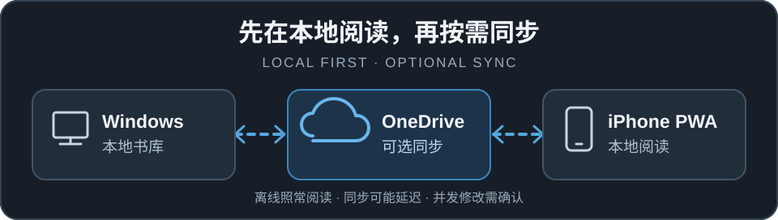
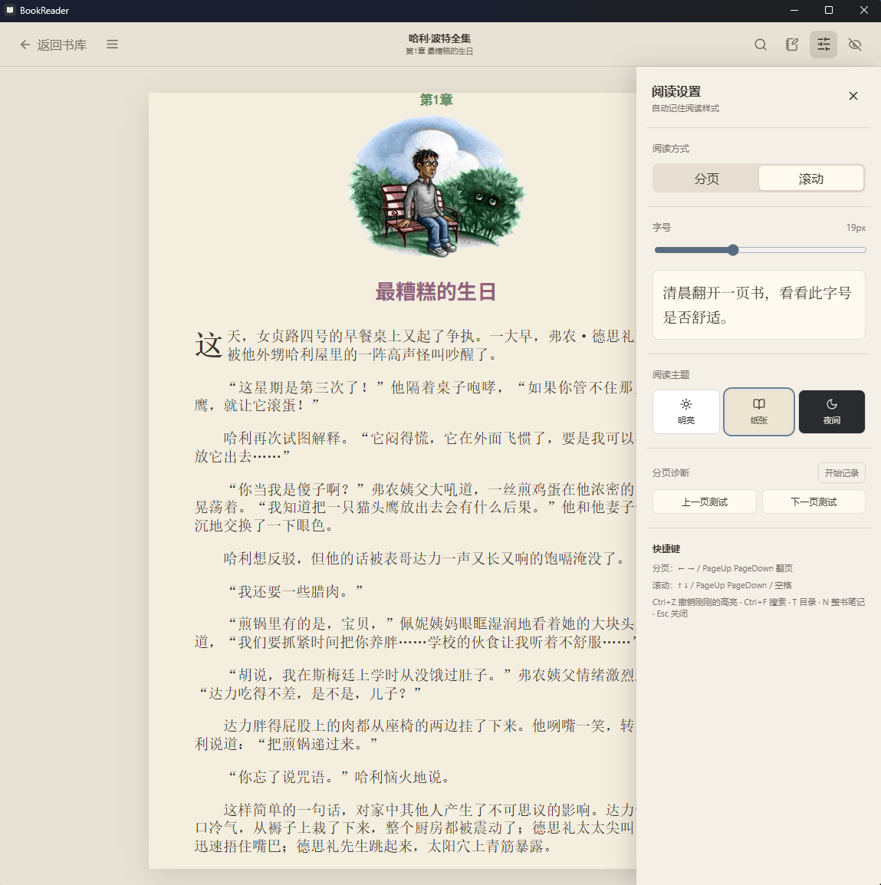

# BookReader

**Read locally. Continue anywhere.**

本地优先的 EPUB 阅读器。Windows 与 iPhone 各自保存阅读数据，连接 OneDrive 后可选择同步书库、进度与笔记。

<kbd>Windows Desktop</kbd> &nbsp; <kbd>iPhone PWA</kbd> &nbsp; <kbd>EPUB</kbd>

[下载 Windows v0.2.1](https://github.com/LH-scanf/BookReader/releases/download/v0.2.1/BookReader_0.2.1_x64-setup.exe) · [查看文档](docs/README.md) · [所有 Releases](https://github.com/LH-scanf/BookReader/releases)

当前公开 Release 为 Windows v0.2.1。图示中的 V1 跨端同步能力尚未正式发布。

## Preview

<table>
  <tr>
    <td width="50%" align="center">
      
       <b>把书留在身边</b> Windows 书库
    </td>
    <td width="50%" align="center">
      
       <b>按自己的方式阅读</b> Windows 阅读设置
    </td>
  </tr>
  <tr>
    <td width="50%" align="center">
      
       <b>记下触动你的文字</b> Windows 整书笔记
    </td>
    <td width="50%" align="center">
      
       <b>换个屏幕，继续读</b> iPhone PWA 阅读设置
    </td>
  </tr>
</table>

截图来自仓库当前 V1 代码；点击可查看原图。公开安装包 v0.2.1 的界面与功能可能不同。

## Cross-device Sync

阅读、进度和笔记先保存在本机；离线时可继续使用已保存的内容。连接 OneDrive 后，Windows 通过本机 OneDrive 同步目录，Web/PWA 通过应用专用目录同步。同步可能延迟；笔记或摘录发生并发修改时，由用户选择保留的版本。详见[数据与同步](docs/DATA_SYNC.md)。

## Get Started

- **Windows：** 安装 [v0.2.1 x64 安装包](https://github.com/LH-scanf/BookReader/releases/download/v0.2.1/BookReader_0.2.1_x64-setup.exe)，选择本地书库并导入 EPUB。
- **iPhone PWA：** 当前没有公开体验地址。按[部署说明](docs/DEPLOYMENT.md)部署 HTTPS 站点后，在 Safari 中通过「分享」→「添加到主屏幕」安装。

## Built With

Tauri 2 · React · TypeScript · Rust · epub.js。开发与构建命令见[部署文档](docs/DEPLOYMENT.md)。

## Documentation

[文档入口](docs/README.md) · [当前状态](docs/CURRENT_STATE.md) · [数据与同步](docs/DATA_SYNC.md) · [部署与运行](docs/DEPLOYMENT.md) · [测试](docs/TESTING.md)
